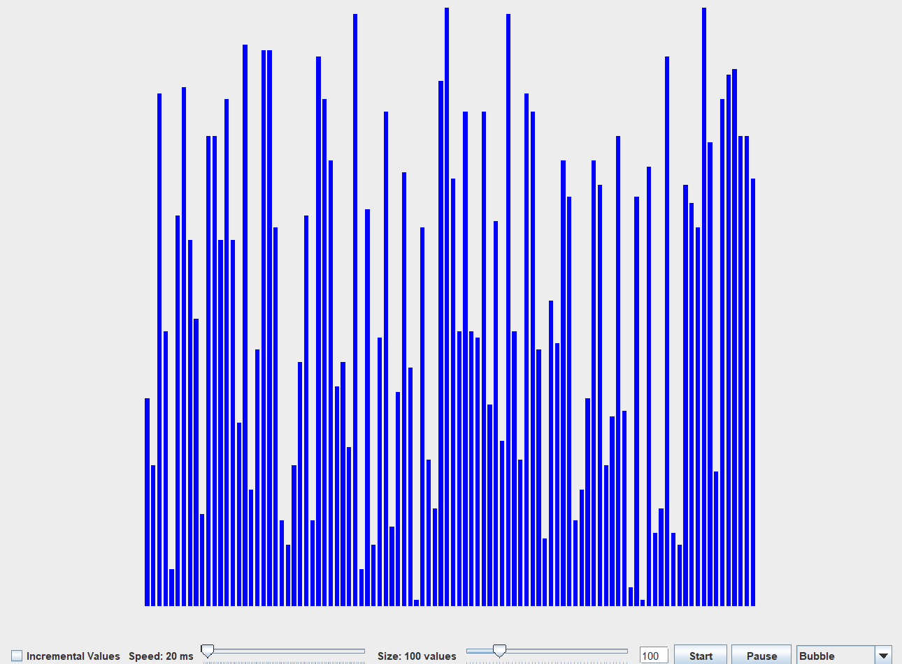

# SortingVisualizer

This is part of an open source project aimed at demonstrating different sorting algorithms to younger audiences. The original project and its author can be found at https://github.com/Dadadah/sorting-visualization.  
In my copy, I made several changes to the GUI, increased functionality for the UX/ main thread interaction, added or reimplemented additional sorting algorithms, plus some other code structure and quality changes.  

Demo of my version:  
   
Summary of Changes:  
  - Implemented Pausing/Resuming functionality to better visualize temporary array
  - Implemented dual text/slider support for size input (but not for speed, since that isn't as important)
  - Improved synchronization for GUI and main thread
  - Enhanced code quality with standard OOP principles (exception handling, multithreading performance, file layout, documentation, etc.)
